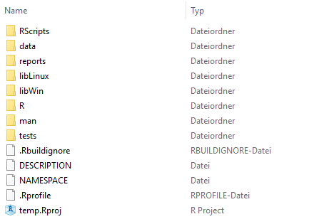

Have you ever tried to find your way around in the file structure of an already
existing project? To separate relevant from obsolete files in a *historically
grown* directory? To find out in which order existing scripts should be
executed?

To make all this easier, it helps to have a consistent file and folder structure
across your projects. You should have some experience with R, RStudio and maybe
package development to find this useful. We also believe our structure is of
special interest for those who work with R in a team. Similar to coding style
guidelines it is more important that you can agree on *one* than picking the
*best* one.

## A useful file structure

There is of course not the one and only best file structure. The following
figure shows our solution for a project's file structure:

When you are working with RStudio you will recognize the *.Rproj* file. This file
determines the project root and also the working directory for R sessions. This
has the advantage that all file paths can be set relative to the project's root
directory. You can move the whole project folder and all paths in your code will
still be working!

The first folder is called *RScripts*. It contains all scripts written in R.
Typical examples are scripts for data preparation and data analysis. We
recommend to number the scripts in the order they need to be executed. See
also [our other article](??) for guidelines for script files. Scripts may
produce outputs. Outputs can be *data*, as in spreadsheet like tabular form, or
any other form like graphics, tables as *.tex* files, etc. These outputs are
then stored either in the *data* or *results* folders. The distinction between
the two folders is sometimes fuzzy but in general the *data* folder stores
everything the data analysis is based on. The *results* folder is used to store
the final outputs of an analysis and not some intermediate steps.

All data (raw and processed) live in the folder *data*. This includes different
file formats such as *.Rdata*, *.xlsx* or *.cvs*. These data are kept separate
from any R packages to enable fast deployment cycles; e.g. when they are large
this can be an issue. Also they are not checked in into version control. In most
scenarios these data files are the output of some R script doing time consuming
data transformations or extracting data from external resources (think of
databases or crawler). Hence these files can always be reconstructed; this folder
is never used as a persistent file storage.

The *results* folder may live inside the *data* folder or also in the root. If
you want to save something you computed, you also put it into this folder, maybe
in a sub-folder *results*. For example, you may store the results from
time-consuming model computations to use them later in a report. Often files in
this folder are used to cache results which are later needed in a markdown
report. Although `knitr` provides it's own caching mechanism in many projects it
is better to decouple single computations so editing of reports is simpler.

The *reports* folder contains the reports we create
with [R Markdown](http://rmarkdown.rstudio.com/). For these reports we have our
own R Markdown templates and `ggplot2` theme. Complying to corporate design
guidelines has never been easier.

## Where does the package live?

Virtually all of our projects include an R package. R packages have their own
specific file and folder structure, but where should these files be located?
There are two options: Either all package files are stored in an own folder
(called for example *package* as in fig. 1), or they are stored in the project’s
root directory (as in fig. 2).

Which way should be preferred depends on the nature of the project. A data
analysis is always backed up by a package. Even if the functions are never used
in any other project we still need documentation and unit tests for R code.
Furthermore dependencies need to be installed and maintained across the team and
machines. So in an analysis, e.g. forecasting sales or computing
a [customer lifetime value](https://www.inwt-statistics.com/business-cases/customer-lifetime-value.html)),
the package lives in it's own folder. This also avoids a conflict: In general,
you will have a *data* folder in an analysis project. Packages also include a
folder named *data*, so R would try to include your data folder when building
the package. This may not be what you want.

In projects where package development is the main task, the package lives in the
project root. This is the case for our
[INWTUtils package](https://github.com/INWT/INWTUtils) or in general when packages 
are used to provide tools used across projects.

## Work in a sandbox

We install all R packages -- our own packages and those from CRAN -- on a
network drive. Thus, everyone in the team has access to the same package
versions. But if someone is working on one of our packages, it is not desirable
that every little change appears immediately on the network drive: It could
contain bugs and disrupt the colleagues’ work.

To solve this problem, we always work in a sandbox when making changes to a
package. More precisely, every time we build a new version of the package, it is
not deployed to the network drive, but into a particular folder you can see in
figure 1: *libLinux* and *libWin* (depending on the operating system). This
means that everything we try out remains in a self-contained environment without
causing any change outside. We need the distinction for OSs because users may
work on user specific network drives but from different machines (8 threads and 16
GB RAM on Windows is not enough? How does 32 threads and 250 GB RAM sound?). This is
however just a small boost for developer productivity.

How does RStudio know where to install the package when we build it? The
*.Rprofile* file is responsible for this task. It is always sourced when you
open R. Our *.Rprofile* changes the default installation directory in your R
project to *libLinux* resp. *libWin*. An example file can be seen [here](https://github.com/INWT/INWTUtils/blob/master/.Rprofile). In addition, the folders *libLinux* and *libWin* are a good place to install
packages you just want to try out without affecting the network drive.

Even if you don't share a package directory on a network drive with your
colleagues, working in a sandbox can have advantages. You can for example work
on your own package without affecting the stable version in your user library.

 
## Just get started!

It’s still hard enough to orient yourself in a project where many people left
their mark on. But it becomes easier if the file structure is consistent and
well thought through. And this also forces you to work in such a way that your
colleagues don’t get lost in your files and folders.

To get started we use the [INWTUtils package](https://github.com/INWT/INWTUtils)
which can instantiate folders and package structures complying to these
standards. This is a good way to get everyone on the team into using it.
