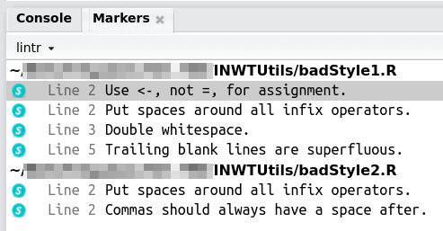

## Overview

This vignette describes how to check your code for a good style
with `checkStyle` (a wrapper for the `lint` function of the
`lintr` package). The function is tailored to the usage at the INWT Statistics
company but can by applied in any context without any disadvantages.

For several so-called *linters* the functions checks if they appear in the code.
Linters are violations of style rules, e.g., missing spaces around operators,
double spaces, very long lines or trailing blank lines. Section "Tested linters"
gives more information about the set of tested linters.


## Why to check your style

Your code may be robust and fast in spite of a bad style. But a good style
makes your code more beautiful and easier to read -- especially for others.
Adapting a consistent style in a team helps to find your way around in the code
written by someone else.


## How to use `checkStyle`

To demonstrate the usage of `checkStyle`, we first create two a scripts full of
bad style examples:

```{r badStyleScript}
writeLines(c("# This is an example for bad style",
             "x = 1+2",
             "# A comment with  double  spaces",
             "foo <- function( y) print(paste('You entered', y))",
             ""),
           con = "badStyle1.R")
writeLines(c("# This is a second example   ",
             "z<-c(1,2)"),
           con = "badStyle2.R")
```

`checkStyle` can be applied to one or more files.
With the `type` argument you can optionally specify if they are scripts
(`type = "script"`) or a files containing package functions
(`type = "pkgFuns"`). Specifiying the type adds some linters to the set of
tested linters.

```{r checkStyle, results = "hide"}
library(INWTUtils)
checkStyle(files = c("badStyle1.R", "badStyle2.R"),
           type = "script")
```

A new tab opens in RStudio which lists all problems found in the checked files.
It contains the full path of the tested files and a list with line numbers and
problems for each file. You can start to edit the code and repeat the check
until the opened tab remains empty.




## Tested linters

The following linters are tested:

```{r lintersAlways, results = 'asis', echo = FALSE}
cat("-", paste0(names(selectLntrs()), collapse = "\n\n- "))
```

If `type = "script"`, the following linters are added:

```{r lintersScript, results = 'asis', echo = FALSE}
cat("-", paste0(names(INWTUtils:::scriptLntrs()), collapse = "\n\n- "))
```

If `type = "pkgFuns"`, the following linters are added:

```{r lintersFuns, results = 'asis', echo = FALSE}
cat("-", paste0(names(INWTUtils:::pkgFunLntrs()), collapse = "\n\n- "))
```

`double_space_linter` checks for double empty spaces.

`internal_INWT_function_linter` checks for the use of internal functions from
packages having a name starting with INWT. Outside of the INWT company, this
linter will barely not go into action. [^a]

[^a]: In general, there is a reason why an internal function has not been exported. Either it should not be used in another context than the its package, or the author did not want to write a documentation. To avoid the latter, we want to be notified about the usage of an internal INWT function so we can add a documentation to the function

`setwd_linter` and `setwd_linter` check for `setwd` or `source` statements
because they should not be used in functions.

The remaining linters are taken from the `lintr` package.
Details about them can be found in the lintr help via `?lintr::linters`.


## Exclude lines from checking

Sometimes you may want to exclude specific lines from the checks because there
is some reason why the found linter cannot be removed. You achieve this by
adding the `nolint` commands (see also `?lintr::exclude`):

```{r nolint, eval = FALSE}
# nolint start
x <- c(1,2)
# nolint end
```
